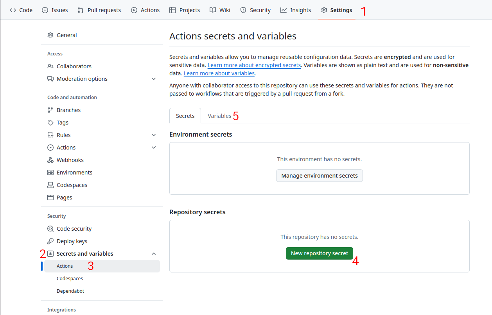

# Workshop: Build a Minimum Viable Platform in 2 hours

This workshop is part of the _Platform Engineering with AWS + DNB + Humanitec: Day of Containers_. It starts at 12:30 on Wednesday 9th October 2024.

## Welcome to the workshop!

In this workshop we will set up a Minimal Viable Platform in 2 hours. AWS has very kindly provided Lab environments for us to work in, so let's get started.

## 00 - Prerequisites

- Claim your Humanitec Organization. You should have got an email with an invite link.

- Claim your AWS Lab environment. Details will be shared during the event.

- Details about EKS Workshop and AWS Lab environments [details here](https://snapshots.eksworkshop.com/1335da97/docs/introduction/setup/aws-event)

- Clone this repository into the home directory of your Lab Environment:
  ```
  git clone https://github.com/pe-day-oslo-2024-10-09/workshop.git
  ```

- Install the Humanitec and other tools we will be using:
  ```
  cd workshop
  sh setup-tools.sh
  ```

- Authenticate the Humanitec CLI inside the lab environment:
  ```
  humctl login
  ```
  It will produce a message something like this:
  ```
  Please use the following URL to approve login request
  https://app.humanitec.io/devices#login_code=ABC-XYZ
  ```
  Copy and paste the URL into a web browser on your local machine and complete the authentication there.

- Set up your environment:
  ```
  sh setup-environment.sh
  ```

> [!NOTE]
> Setup is done! Now we can get on with the workshop. We will run things through step-by-step so you can follow along easily.

## 01 - Connecting the EKS cluster to Humanitec

To do this, we will use the Humanitec Setup Wizard. It will ask you a series of questions and then configure access and register the EKS cluster with the Platform Orchestrator.

1. Run the wizard:
   ```
   humanitec-setup-wizard connect
   ```

> [!IMPORTANT]
> The wizard will ask you questions, in most *but not all* cases you can select the default answer. Here is an example run through:

   <pre>
   
   ? Select organization: <b>pe-day-oslo-<i>my-name-here</i></b>
   
   ? Select cloud provider: <b>aws</b>
   
   ? Please enter the id for the cloud account you would like to create in your Humanitec Organization: <b>my-cloud-account</b>
   
   ? Only one cluster found: <i>eks-workshop</i>. Do you want to use it: <b>Yes</b>
   
   ? Only one load balancer found: <i>abcdef012456789abcdef012456789</i>. Do you want to use it?: <b>Yes</b>
   
   ? Please enter the id for the cluster you would like to create in your Humanitec Organization: <b>my-cluster</b>
   
   ? Cluster is publicly available. Do you want to install Humanitec Agent anyway? <b>Yes</b>
   
   ? Only one secret manager found: aws-secret-manager. Do you want to use it <b>Yes</b>
   
   ? Please enter the namespace for the operator you would like to create in your Humanitec Organization: <b>humanitec-operator-system</b>
   
   ? Would you like to configure the operator to authenticate Humanitec drivers? <b>Yes</b>
   
   ? Please enter the id for the secret store you would like to create in your Humanitec Organization <b>my-secret-store</b>
   
   ? Please enter the id of the namespace where the runner will run. The wizard will create it if it does not exist. <b>humanitec-terraform</b>
   
   ? Please enter the name of the k8s service account the wizard will create to let the runner run with <b>humanitec-tf-runner</b>
   
   ? Please enter the id of the config resource definition that will be created to inject Terraform runner credentials <b>my-tf-runner-config</b>
   
   ? Please enter the id of the terraform-runner driver resource definition that will be created to provision a fake s3 bucket (my-vd-tf-fake-s3) 
   
   ? Do you want to deploy a test application? <b>Yes</b>
   
   ? Please enter the id for the application you would like to create in your Humanitec Organization <b>my-application</b>
   </pre>

   After a few seconds, the application should be running in the cluster. You can go to the Humanitec Portal to view it: [app.humanitec.io](https://app.humanitec.io)

## 02 - Deploy the first workload

Let's start with our Score-based workload. This will deploy a workload running [stefanprodan/podinfo](https://github.com/stefanprodan/podinfo) exposed with a DNS name.

> [!INFO]
> Score is a platform-agnostic workload specification. It’s a Cloud Native Computing Foundation (CNCF) project. Learn more at [score.dev](https://score.dev).

### Steps

1. Change into the `first-score` directory:
   ```
   cd first-score
   ```

2. Review the Score file:
   ```
   cat score.yaml | yq
   ```
> [!TIP]
> `yq` will give you nice syntax highlighted output of YAML files and will also validate your YAML is correct. See [yq Docs](https://mikefarah.gitbook.io/yq).

3. Create a new application to deploy out workload in:
   ```
   humctl create app first-score
   ```

4. Deploy the workload into the app:
   ```
   humctl score deploy -f score.yaml --app first-score --env development --wait
   ```

5. Go to the [Humanitec Portal](https://app.humanitec.io) to view the deployment.

## 03 - Add CI for Preview Environments

Deploying using `humctl score deploy` is all very well, but a better developer experience is to do this automatically when we `git push`.

### Steps

1. Get your AWS account to trust your GitHub user. Replace `<GITHUB_NAME>` with your github username.
   ```
   cd ../use-ci
   sh trust-github-actions.sh <GITHUB_NAME>
   ```
   Save the `Role ARN` that is returned by the script. You will need it later.

2. Create a new app
   ```
   humctl create app jokes
   ```

3. Generate a service user token for the CI.
   1. Go to the [Humanitec Portal](https://app.humanitec.io)
   2. Select _Service Users_ from the left hand menu
   3. Click `+ Create new service user`
   4. Choose a name, select "Administrator" for the role and click `Create new service user`
   5. Expand the new service user and click `+ Add new API token`
   6. Choose a name for the token and click `Create new API token`
   7. Copy the `API token` somewhere safe - you will need it later.

4. Create the GitHub Repository with the CI
   1. Go to [github.com/pe-day-oslo-2024-10-09/tell-a-joke](https://github.com/pe-day-oslo-2024-10-09/tell-a-joke)
   2. Click the green `Use this template` button in the top right.
   3. Choose a location to create it. (Recommendation: use your own GitHub.)

5. Configure GitHub Actions

   This involves setting some variables and secrets in GitHub Actions. To find the Secrets and Variables, follow the numbers in this image in your new repository.
   

   Create the following  _Repository Secret_:
   -  `HUMANITEC_TOKEN` with value of the `API token` (from step 3)

   Create the following create 3 `Variable` values:
   - `HUMANITEC_APP` with the value `jokes`
   - `HUMANITEC_ORG` with your Humanitec Organization ID (e.g.: `pe-day-oslo-…`).
   - `AWS_ROLE_ARN` with the `Role ARN` (from step 1)

> [!TIP]
> You can find your Organization ID with `humctl config org`

6. Test GitHub Actions

   In the repository page in GitHub:
   1. Select the _Actions_ tab
   2. Open the failed CI job
   3. Click _Re-run Jobs_
   4. Wait - after a while it should succeed!
   5. View the `jokes` application in the [Humanitec Portal](https://app.humanitec.io).
